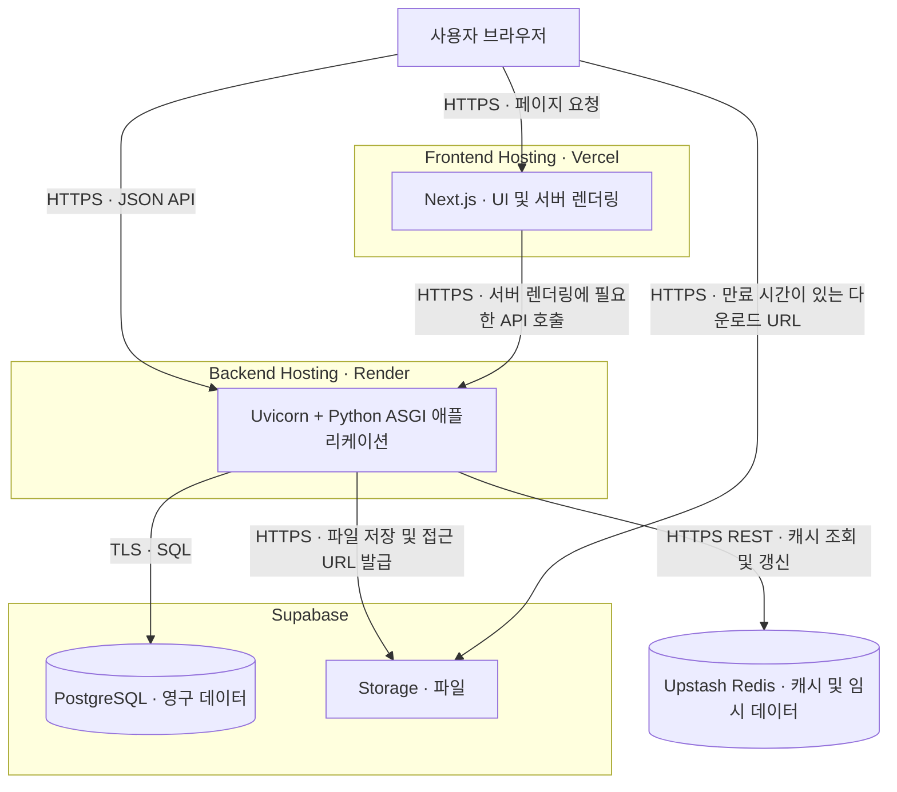

# 시스템 아키텍처

작성일: 2026-09-29 · 상태: 초기 설계안

## 1. 목적과 범위

Next.js 기반 웹 애플리케이션과 Python API 서버를 분리 배포하고, Supabase와 Upstash를 이용해 영구 데이터, 파일, 캐시를 관리한다. 이 문서는 제공된 기술 스택을 기준으로 구성 요소의 책임, 통신 경로, 배포 및 운영 원칙을 정의한다.

## 2. 기술 스택

| 영역 | 기술 | 역할 |
| --- | --- | --- |
| Frontend | Next.js · TypeScript · Zustand | App Router, 웹 UI, 전역 클라이언트 상태 관리 |
| Frontend Hosting | Vercel | Next.js 애플리케이션 배포 및 호스팅 |
| Backend | Python · FastAPI | API, 비즈니스 로직, 입력 검증 및 권한 검사 |
| Backend Server | Uvicorn | Python ASGI 애플리케이션 실행 |
| Backend Hosting | Render | 백엔드 프로세스 배포 및 운영 |
| Database | Supabase PostgreSQL | 영구 데이터와 파일 메타데이터 저장 |
| Storage | Supabase Storage | 파일 및 오브젝트 저장 |
| In-memory DB | Upstash Redis | 재생성 가능한 캐시와 TTL 기반 임시 데이터 저장 |

## 3. 전체 구성

브라우저는 화면을 Vercel에서 받고 업무 데이터는 Render API로 요청한다. 서버 렌더링이 필요한 페이지는 Next.js 서버에서 같은 API를 호출한다. 데이터 변경과 권한 검사는 Python API에서 수행한다.

파일 다운로드는 API의 권한 확인 후 발급한 서명 URL로 Storage에 직접 접근한다.

## 4. 구성 요소별 책임

### 4.1 Next.js / Vercel

- 페이지, UI 상태, 사용자 입력 및 오류 메시지를 처리한다.
- 브라우저 호출과 서버 렌더링 호출 모두 공통 API 계약을 사용한다.
- 사용자별 데이터가 공용 페이지 캐시에 저장되지 않도록 렌더링 및 캐시 정책을 명시한다.
- 비즈니스 규칙과 DB 접근은 Python API에 둔다. Next.js 서버 기능에는 화면 구성에 필요한 처리만 둔다.

Vercel의 Next.js 배포 지원 범위는 [공식 가이드](https://vercel.com/docs/frameworks/full-stack/nextjs)를 따른다.

### 4.2 Python / Uvicorn / Render

- 요청 인증, 자원별 권한 검사, 입력 검증, 업무 규칙을 처리한다.
- PostgreSQL 트랜잭션, 캐시 갱신, Storage 접근을 조정한다.
- API 계층 → 서비스 계층 → 데이터 접근 계층으로 책임을 나눈다.
- 인스턴스 로컬 메모리나 로컬 파일에 사용자 세션 및 영구 데이터를 의존시키지 않는다.
- DB와 HTTP 클라이언트 연결을 재사용하고, 비동기 경로에서 장시간 블로킹 작업을 피한다.

### 4.3 Supabase PostgreSQL

- 업무 데이터의 기준 저장소로 사용한다.
- 외래 키, 유일 제약조건, 트랜잭션으로 데이터 무결성을 보장한다.
- 파일 자체 대신 버킷, 오브젝트 경로, 소유자, 크기, 콘텐츠 유형, 상태를 저장한다.
- 스키마 변경은 버전 관리하는 마이그레이션으로 수행한다.

Render에서의 DB 접속은 네트워크 지원과 연결 수를 확인해 직접 연결 또는 Supavisor 세션 풀러를 선택한다. 트랜잭션 풀러를 선택하면 드라이버와 prepared statement 호환성을 별도로 확인한다. 애플리케이션 연결 풀 크기 × 워커 수 × 인스턴스 수에 운영 여유를 더한 값이 연결 한도를 넘지 않도록 한다. [Supabase 연결 가이드](https://supabase.com/docs/guides/database/connecting-to-postgres)

### 4.4 Supabase Storage

- 사용자 파일은 기본적으로 비공개 버킷에 보관한다.
- API가 소유권과 접근 권한을 확인한 뒤 업로드 또는 다운로드를 허용한다.
- 공개 배포가 필요한 정적 자산만 별도의 공개 버킷에 보관한다.

비공개 파일은 만료 시간이 있는 서명 URL로 제공할 수 있다. URL을 소지한 사람은 유효기간 동안 접근할 수 있으므로 짧은 만료 시간을 사용하고 로그에 남기지 않는다. [Storage 다운로드 가이드](https://supabase.com/docs/guides/storage/serving/downloads)

### 4.5 Upstash Redis

- 반복 조회 결과와 만료 가능한 임시 값을 저장한다.
- 모든 캐시 키에 목적에 맞는 TTL을 설정하고, 영구 데이터의 유일한 저장소로 사용하지 않는다.
- 초기 연결 방식은 HTTPS REST로 제안하며, Python 클라이언트 및 필요한 명령 지원을 구현 시 검증한다.
- 환경과 데이터 범위가 섞이지 않도록 키를 구분한다. 예: `prod:resource:v1:{tenant_id}:{resource_id}`.

Upstash는 REST API를 제공한다. 토큰은 백엔드 비밀 설정으로 보관한다. [Upstash REST API](https://upstash.com/docs/redis/features/restapi)
