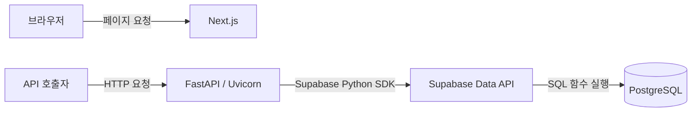

# 시스템 아키텍처

웹 화면은 Next.js, API는 FastAPI로 구성한다. 프론트엔드와 백엔드는 별도로 실행하며, 백엔드는 Supabase Data API를 통해 PostgreSQL에 접근한다. 이 문서는 기술 스택, 폴더 구조, 구성 요소의 역할과 통신 방식을 설명한다.

## 기술 스택

| 영역 | 기술 | 용도 |
| --- | --- | --- |
| 웹 화면 | Next.js · React · TypeScript | App Router 기반 페이지와 UI 구성 |
| UI 상태 관리 | Zustand | 메뉴 열림 여부 등 클라이언트 상태 관리 |
| API | Python · FastAPI · Uvicorn | HTTP 요청 처리와 ASGI 서버 실행 |
| 설정 관리 | Pydantic Settings | 백엔드 환경변수 로딩과 값 검증 |
| 데이터 접근 | Supabase Python SDK · HTTPX | 비동기 Data API 호출과 HTTP 연결 재사용 |
| 데이터베이스 | Supabase PostgreSQL | 데이터 저장과 SQL 함수 실행 |
| 웹 호스팅 | Vercel | Next.js 배포 대상 |
| API 호스팅 | Render | FastAPI 배포 대상 |
| 로컬 개발 | Node.js · npm · Supabase CLI · Docker | 의존성 설치와 개발 서버·로컬 Supabase 실행 |

Node.js 기본 버전은 `.nvmrc`에 지정한 24이며, Python은 3.12 이상을 사용한다. 앱 의존성은 `frontend/package.json`과 `backend/requirements.txt`에서 관리한다.

Supabase Storage는 파일 저장, Upstash Redis는 캐시와 임시 데이터 저장을 위한 설계 대상이다. 두 서비스의 애플리케이션 연동은 현재 코드에 포함되어 있지 않다.

## 폴더 구조

```text
frontend/
  public/                       웹에서 제공하는 정적 이미지와 아이콘
  src/
    app/                        페이지, 루트 레이아웃, 전역 스타일
    components/                 UI 컴포넌트
    providers/                  Zustand 스토어를 공유하는 Provider
    stores/                     UI 상태와 상태 변경 함수
    lib/                        공통 API 호출, 응답 타입과 오류 처리
backend/
  app/
    api/
      routes/                   기능별 API 라우터와 상태 확인 API
    core/                       환경변수 설정, 공통 오류와 예외 처리
    db/                         Supabase 클라이언트 생성과 요청 의존성
    auth/                       비밀번호 해시와 로그인 세션 저장
    mail/                       공통 메일 인터페이스와 SMTP·Resend 구현
    schemas/                    공통 응답·오류 및 API 데이터 모델
  tests/                        API 응답 계약 및 메일 발송 테스트
supabase/
  migrations/                   DB 스키마와 SQL 함수 변경
scripts/                        OS별 설치와 개발 서버 실행·재시작·종료
  tests/                        설치·실행 스크립트 테스트
docs/                           문서 인덱스와 시스템 아키텍처
  frontend/                     공용 UI와 인증 화면 안내
  local-development/            로컬 개발환경과 실행 안내
    setup/                      공통 설치와 OS별 준비 사항
  engineering/                  코딩·커밋·PR·Jira 작업 규칙과 기능 안내
  deployment/                   배포 안내
```

웹에 사용할 정적 파일은 `frontend/public/`에 둔다.

## 구성 요소와 통신



프론트엔드에서 API를 호출할 때는 `src/lib/api.ts`의 `apiFetch`를 사용한다. 일반 API 요청 주소는 `NEXT_PUBLIC_API_BASE_URL`을 기준으로 만들고, 인증 API는 같은 출처의 Next.js 경로로 중계한다. 응답은 캐시하지 않는다.

JSON API는 `{ success, data, error }` 공통 응답 구조를 사용한다. 성공 시 `data`와 `error: null`, 실패 시 `data: null`과 오류 코드·문구·필드별 오류를 반환한다. HTTP 상태 코드는 유지한다. 프론트의 `apiFetch<T>()`는 공통 구조를 검사하고 성공 데이터를 반환하며, 실패는 `ApiRequestError`로 전달한다. 상세 규격과 적용 방법은 [공통 API 응답 모델](engineering/api-response.md)을 따른다.

### 프론트엔드

Next.js App Router가 페이지와 레이아웃을 구성한다. `UiStoreProvider`는 Zustand 스토어를 생성해 하위 컴포넌트에 제공하고, 컴포넌트는 `useUiStore`로 필요한 상태를 읽거나 변경한다. 데이터베이스 접근은 백엔드에서 처리한다.

### 백엔드

`app/main.py`는 앱 초기화, CORS·예외 처리 등록과 라우터 연결을 담당한다.
API 엔드포인트는 `app/api/routes/`에 둔다. 설정과 공통 오류 처리는
`app/core/`, DB 연결은 `app/db/`, 응답 모델은 `app/schemas/`에서 관리한다.

FastAPI가 API 요청을 처리하고 Uvicorn이 서버를 실행한다. 앱이 시작될 때 비동기 HTTP 클라이언트와 Supabase 클라이언트를 생성한다. 요청마다 같은 클라이언트를 재사용하고, 앱이 종료될 때 HTTP 연결을 정리한다.

백엔드 설정은 `app/core/config.py`에서 읽고 검증한다. CORS는 `CORS_ORIGINS`에 지정한 출처의 요청을 허용한다.

`app/mail/`은 공통 `Mailer` 인터페이스로 SMTP 또는 Resend HTTPS API를 사용한다.
`base.py`에 인터페이스와 인증 메일 본문을 정의하고, `smtp.py`와 `resend.py`에
각 제공자의 발송 구현을 둔다. `dependencies.py`의 `get_mailer()`는
`MAIL_PROVIDER` 설정으로 구현을 선택하며 기본값은 `resend`다.
인증번호 발급·검증과 회원가입 API는 포함하지 않는다. 설정과 사용법은
[SMTP·Resend 이메일 발송](engineering/email-delivery.md)에서 확인한다.

| API | 역할 |
| --- | --- |
| `GET /api/v1/health` | API 서버의 응답 확인 |
| `GET /api/v1/health/db` | Supabase의 `health_check` 함수를 호출해 DB 연결 확인 |

DB 상태 확인 중 호출이 실패하거나 함수가 `true`를 반환하지 않으면 HTTP 503으로 응답한다. 로그인과 사용자별 권한 검사는 이 상태 확인 API에 포함되지 않는다.

로그인 API와 회원·세션 테이블은 [이메일 로그인과 세션](engineering/login-auth.md)을 따른다. 인증은 FastAPI에서 처리하며 Supabase Auth는 사용하지 않는다.

상태 API는 Pydantic의 `ApiSuccess[T]` 모델로 응답하며, 입력 검증·HTTP 예외·내부 오류는 공통 `ApiFailure` 모델로 변환한다. 내부 예외 문구와 입력 원문을 응답으로 노출하지 않는다. CORS 내부 오류 경계가 예상하지 못한 500 오류에도 허용 Origin 헤더를 적용한다. 성공 모델과 공통 오류 모델은 OpenAPI에 반영한다.

### 데이터베이스

백엔드는 `SUPABASE_URL`과 서버 전용 `SUPABASE_SECRET_KEY`로 Supabase Data API를 호출한다. DB 비밀번호로 직접 접속하지 않으며, 서버 키는 프론트엔드에 전달하지 않는다.

DB 변경은 `supabase/migrations/`의 SQL 파일로 관리한다. `health_check` 함수는 `service_role`에 실행 권한을 부여한다. 마이그레이션 적용은 앱 실행과 별도로 수행한다.

## 관련 문서

설치·실행·환경변수·배포 안내는 [문서 목록](README.md)에서 확인한다.
