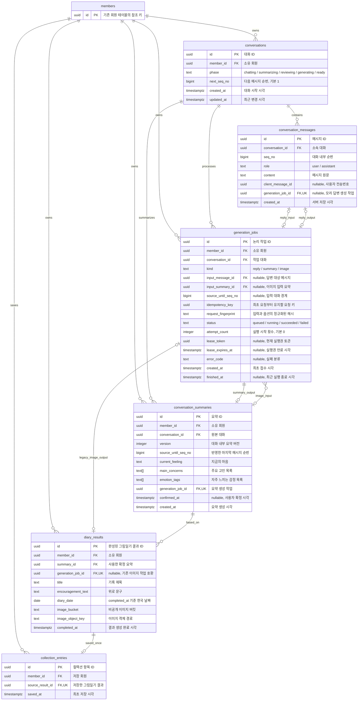

# 대화·컬렉션 ERD

대화 이후 새로 생성할 요약·일기·이미지를 저장하는 신규 업무 테이블 설계다. 기존 `members`와 신규 테이블 6개를 연결한다. [Supabase 마이그레이션 SQL](../../supabase/migrations/20261007071605_conversation_collection_schema.sql)은 최초 스키마이며 운영 적용 상태는 별도로 확인한다.

현재 이미지 MVP는 [요약 기반 그림일기 MVP](diary-mvp.md)를 따른다. 이미지 생성은 요청 안에서 직접 수행하며 이미지 job·큐·lease·폴링을 사용하지 않는다. 기존 마이그레이션 이력을 보존한 [보정 SQL](../../supabase/migrations/20261008054127_mvp_direct_diary_image.sql)로 결과를 요약에 직접 연결한다. 아래 job 관련 설명 중 대화·요약 부분은 기존 설계이며 이미지 작업 부분은 이전 설계의 호환 구조다.

Jira와 연결된 [테이블 설계 요약](https://younkim.atlassian.net/wiki/spaces/GOMIN/pages/4128771/GOMIN-74)에는 주요 컬럼·관계만 두고, 전체 ERD와 설계 이유·질문·답변은 이 문서에서 관리한다.

## 테이블과 관계

`members`는 기존 테이블 중 참조에 필요한 `id`만 표시했다. 신규 테이블에서 `nullable` 표기가 없는 컬럼은 NOT NULL이다. PK는 기본키, FK는 외래키, UK는 단일 컬럼의 유일 제약이다. 복합 유일 제약은 아래에 별도로 명시한다.

관계의 `||`는 정확히 하나, `o|`는 0개 또는 하나, `o{`는 0개 이상을 뜻한다. 작업의 입력·출력 관계는 `kind`에 따라 선택적으로 사용하며, 작업이 완료되기 전에는 출력 행이 없다.

| 테이블 | 역할 |
| --- | --- |
| `conversations` | 하나의 대화와 현재 진행 단계 |
| `conversation_messages` | 사용자·모리의 원문과 대화 내부 순서 |
| `conversation_summaries` | 대화의 일정 범위를 정리한 요약 버전 |
| `generation_jobs` | AI 작업의 입력·실행 상태·재시도 횟수 |
| `diary_results` | 이미지 생성과 업로드가 완료된 그림일기 결과 |
| `collection_entries` | 사용자가 컬렉션에 저장한 결과와 저장 시각 |

## 핵심 제약조건

| 대상 | 제약 |
| --- | --- |
| 메시지 순서 | `UNIQUE(conversation_id, seq_no)`. 순번은 양수이며 대화 행 잠금 아래 배정 |
| 사용자 메시지 | `client_message_id` 필수, `generation_job_id`는 NULL |
| 모리 메시지 | `generation_job_id` 필수, `client_message_id`는 NULL. 한 reply 작업의 출력은 하나 |
| 메시지 재전송 | `UNIQUE(conversation_id, client_message_id)`. 같은 키에 다른 본문은 거절 |
| 요약 버전 | `UNIQUE(conversation_id, version)`. version과 source_until_seq_no는 양수 |
| 요약 확정 | 본문과 입력 대화 범위는 생성 후 고정. confirmed_at은 최초 확정 때 한 번 기록 |
| 작업 접수 | `UNIQUE(member_id, idempotency_key)`. 같은 키에 다른 입력은 거절 |
| 답변 작업 | `UNIQUE(input_message_id) WHERE kind = 'reply'` |
| 작업 출력 | 각 출력 테이블의 `generation_job_id`는 UNIQUE |
| 이미지 결과 | MVP는 확정 `summary_id`를 직접 참조하며 `generation_job_id`는 NULL. 기존 job 연결 기록만 입력 일치 제약 적용 |
| 기록 날짜 | `diary_date = (completed_at AT TIME ZONE 'Asia/Seoul')::date` |
| 이미지 경로 | `UNIQUE(image_bucket, image_object_key)`. 이미지 바이너리·서명 URL은 DB에 저장하지 않음 |
| 컬렉션 저장 | `UNIQUE(source_result_id)`. 같은 결과를 다시 저장하면 기존 항목과 saved_at 반환 |

`role`과 `kind`, `phase`, `status`는 ERD에 표시한 값만 허용한다. 텍스트 본문·제목·문구·이미지 경로는 공백만 있는 값을 허용하지 않는다. 요약 배열은 NULL·공백 요소를 허용하지 않고 표시 순서를 유지한다. 빈 배열의 허용 여부는 출력 검증 정책에서 정한다.

### 작업별 입력

| kind | input_message_id | input_summary_id | source_until_seq_no |
| --- | --- | --- | --- |
| `reply` | 같은 대화의 user 메시지 | NULL | 해당 메시지 순번 |
| `summary` | NULL | NULL | 요약 요청 때 고정한 마지막 메시지 순번 |
| `image` | NULL | 같은 대화의 확정 요약 | NULL |

이 컬럼 조합은 CHECK로 제한한다. 참조한 메시지의 role, 요약의 확정 여부, 작업과 출력의 종류 일치는 DB 함수·트리거에서 검사한다.

모든 소유 회원은 세션 또는 검증된 부모 행에서 정한다. 서로 다른 회원·대화의 행이 연결되지 않도록 복합 FK와 참조 대상의 복합 UNIQUE를 둔다.

- 요약·작업의 `(member_id, conversation_id)` → 대화의 `(member_id, id)`
- 작업의 입력 메시지와 출력 메시지의 작업 참조는 `conversation_id`를 포함
- 이미지 작업의 입력 요약은 `member_id`와 `conversation_id`를 포함
- 결과의 요약·작업은 동일 회원과 동일 대화를 가리키도록 검사
- 컬렉션의 `(member_id, source_result_id)` → 결과의 `(member_id, id)`

순환 참조가 있으므로 마이그레이션은 테이블 생성 후 FK를 추가한다. 한 대화 또는 하루에 결과 하나만 저장하도록 제한하는 제약은 두지 않는다.

작업 성공 상태와 해당 출력 행은 같은 트랜잭션으로 저장해야 한다. 지연 제약 트리거가 커밋 시 둘의 일치를 검사하므로 성공 작업만 남거나 미완료 작업에 출력만 남는 저장은 거절한다.

## 조회 인덱스

| 조회 | 인덱스 |
| --- | --- |
| 메시지 순서 | `conversation_messages(conversation_id, seq_no)` |
| 최신 요약 | `conversation_summaries(conversation_id, version DESC)` |
| 대화별 작업 | `generation_jobs(conversation_id, created_at DESC)` |
| 회원별 컬렉션 | `collection_entries(member_id, saved_at DESC, id DESC)` |
| 회원별 최근 대화 | `conversations(member_id, updated_at DESC, id DESC)` |

PK·UNIQUE가 지원하는 같은 키의 인덱스는 중복 생성하지 않는다. 컬렉션 목록은 `collection_entries → diary_results`, 상세는 여기에 `conversation_summaries`를 연결해 조회한다.

## ID 생성과 저장 흐름

예시의 A·C1·M1·J1·S1·R1·E1은 UUID의 별칭이다. `seq_no`와 `version`은 정수다.

| 값 | 생성 주체·시점 | 저장 위치 |
| --- | --- | --- |
| 대화 ID A | 서버, 대화 생성 시 | `conversations.id` |
| 전송번호 C1 | 프론트, 최초 메시지 전송 전 | `conversation_messages.client_message_id` |
| 메시지 ID M1 | 서버, 최초 메시지 저장 시 | `conversation_messages.id` |
| 순번 1 | DB, 대화 행 잠금 아래 저장 시 | `conversation_messages.seq_no` |
| 작업 ID J1 | 서버, AI 작업 최초 접수 시 | `generation_jobs.id` |
| 작업 요청 키 | 요약·이미지 요청은 프론트, 내부 reply 작업은 서버 | `generation_jobs.idempotency_key` |
| 요약 ID S1 | 서버, 요약 작업 성공 시 | `conversation_summaries.id` |
| 입력 요약 ID S1 | 새로 생성하지 않고 요약 ID를 참조 | `generation_jobs.input_summary_id` |
| 결과 ID R1 | 서버, 이미지 작업 성공 시 | `diary_results.id` |
| 보관 ID E1 | 서버, 컬렉션 최초 저장 시 | `collection_entries.id` |

`role`은 발화자, `seq_no`는 대화 안의 순서, `id`는 개별 메시지를 가리킨다. `(conversation_id, seq_no)`도 메시지를 유일하게 식별할 수 있지만, 이 설계는 다른 테이블에서 단일 ID로 참조하도록 별도 PK를 둔다. 대화 순서는 UUID 대신 seq_no로 정렬한다.

### 메시지 전송

1. 프론트가 `crypto.randomUUID()`로 C1을 만든 뒤 본문과 함께 보낸다. 서버 사전 발급 요청은 없다.
2. 서버가 대화 소유권을 확인하고 C1의 기존 접수 여부를 조회한다.
3. 신규 요청이면 M1·seq_no=1·reply 작업 J1을 한 트랜잭션으로 저장한다.
4. J1이 성공하면 모리 메시지 M2·seq_no=2 저장과 작업 성공을 한 트랜잭션으로 반영한다.
5. 접수 응답이 유실돼도 프론트는 같은 C1로 재전송한다. 서버는 기존 M1·J1을 반환하며 새 순번을 만들지 않는다.

### 요약부터 컬렉션 저장까지

1. 대화 기능이 요약 S1을 DB에 저장한다.
2. 프론트는 summary_id=S1로 이미지 생성 API를 요청한다.
3. 서버는 본인의 요약을 확인하고 텍스트 모델로 제목·위로·이미지 프롬프트를 만든 뒤 이미지 모델을 호출한다.
4. 이미지 업로드 후 R1을 저장한다. `R1.summary_id=S1`, `R1.generation_job_id=NULL`이며 완료 결과를 바로 반환한다.
5. 저장 버튼으로 `E1.source_result_id=R1`인 컬렉션 항목을 만든다.
6. 목록은 본인의 E1을 조회하고 상세는 `E1 → R1 → S1`을 조회한다.

이미지 재생성 정책·DB 큐·lease·자동 재시도·상태 폴링은 MVP에서 제외한다.

## 설계 관련 질문과 답변

### client_message_id와 generation_job_id는 왜 필요한가?

`client_message_id`는 사용자가 한 번 보낸 요청을 재전송해도 같은 메시지로 처리하기 위한 번호다. 예를 들어 서버가 메시지 M1을 저장했는데 성공 응답이 끊기면, 프론트는 저장 여부를 알 수 없다. 처음 만든 C1로 다시 보내면 서버가 기존 M1을 찾아 반환한다. 같은 내용을 사용자가 의도적으로 한 번 더 보내는 경우에는 새 전송번호 C2를 만든다.

`generation_job_id`는 모리의 답변이 어떤 AI 작업에서 나왔는지 연결하는 번호다. 답변을 만드는 작업 J1과 그 결과 메시지 M2는 서로 다른 데이터다. J1에는 진행·실패·재시도 상태를 저장하고, 성공하면 M2에 `generation_job_id=J1`을 기록한다. 같은 작업의 완료 처리가 반복되어도 UNIQUE 제약으로 답변 하나만 저장할 수 있다.

사용자 메시지 M1에는 C1이 들어가고 generation_job_id는 NULL이다. 모리 메시지 M2에는 J1이 들어가고 client_message_id는 NULL이다. J1의 `input_message_id=M1`이 사용자 질문과 답변 작업을 연결한다.

### role과 순서가 있는데 메시지 id도 필요한가?

| 메시지 id | conversation_id | seq_no | role | 내용 |
| --- | --- | --- | --- | --- |
| M1 | A | 1 | user | 오늘 힘들었어 |
| M2 | A | 2 | assistant | 무슨 일이 있었어? |
| M3 | A | 3 | user | 회사에서 실수했어 |
| M4 | B | 1 | user | 내일 시험이야 |

`role=user`만으로는 M1·M3·M4를 구별할 수 없다. `seq_no=1`도 대화 A와 B에 각각 존재할 수 있다. 메시지 id는 이 중 특정 메시지 하나를 가리키는 값이다. 예를 들어 J1의 입력을 M1로 지정하면 A 대화의 첫 사용자 메시지를 정확히 참조한다.

`(conversation_id, seq_no)`를 묶어도 메시지를 식별할 수 있으므로 별도 id가 논리적으로 필수인 것은 아니다. 이 설계는 외래키와 조회 요청에서 단일 UUID로 참조하기 위해 id를 둔다. 순서는 계속 seq_no로 판단한다.

### 이 ID들은 채팅을 되돌리기 위한 것인가?

현재 목적은 요청·작업 재시도의 중복을 막고 입력과 결과를 연결하는 것이다. 채팅 되돌리기·수정·분기 기능은 이 설계에 포함하지 않았다.

요약 화면에서 다시 이야기하기를 선택하는 흐름은 같은 대화에 새 메시지를 추가하고 새 요약 버전을 만드는 방식이다. S1의 내용을 덮어쓰지 않고 S2를 추가하므로 각 결과가 어떤 요약에서 나왔는지 확인할 수 있다.

### client_message_id는 서버에서 먼저 발급받는가?

프론트가 최초 전송 전에 `crypto.randomUUID()`로 생성한다. 전송 버튼을 누르면 C1과 본문을 묶어서 보관하고 바로 요청한다. 서버는 최초 접수 때 저장 메시지 ID M1과 작업 ID J1을 만든다.

응답을 받기 전 실패하면 C1을 유지해서 재전송한다. 프론트가 만든 번호는 권한 증명이 아니므로 서버는 대화 소유권을 별도로 검사한다. 새로고침 이후에도 미접수 요청을 재전송하려면 프론트의 요청 상태 보존 정책을 정해야 한다.

구조를 단순화하려면 메시지 id 자체를 프론트에서 생성하고 재사용해 client_message_id를 생략할 수도 있다. 현재 안은 전송번호 C1과 저장 메시지번호 M1을 분리한다. 단순화할 경우 생성 주체·충돌 검사·외래키 참조 방식을 함께 변경해야 한다.

### 이미지 생성에 사용한 요약은 어디에 저장되는가?

MVP는 `diary_results.summary_id`에 저장된 요약 ID를 직접 참조한다.
이미지 job은 생성하지 않는다. 컬렉션에서 요약과 대화를 찾는 경로는 `E1 → R1 → S1 → A`다.
`generation_jobs.input_summary_id`는 기존 이미지 작업과 연결된 기록의 호환성을 위해 보존한다.

## 확정한 저장 규칙

### 그림일기 날짜

`diary_results.completed_at`은 이미지 생성·업로드를 마치고 완성 결과를 확정한 시각이다. `diary_date`는 이 시각을 `Asia/Seoul`로 변환한 날짜를 저장하는 생성 컬럼이다. 결과 INSERT에 diary_date를 직접 보내지 않는다. completed_at을 생략하면 DB가 결과 저장 시각을 기록한다.

DB 표현은 `diary_date = (completed_at AT TIME ZONE 'Asia/Seoul')::date`다. 예를 들어 completed_at이 `2026-10-07 15:30:00+00`이면 한국 시간은 `2026-10-08 00:30:00+09`이고 diary_date는 `2026-10-08`이다.

대화 시작일이나 컬렉션 저장일로 계산하지 않는다. 같은 결과의 완료 재처리·컬렉션 재저장은 최초 completed_at·diary_date를 유지한다. 다른 그림을 생성하면 새 결과의 완료 시각으로 새 날짜를 정한다.

### 미저장 결과 보관

컬렉션에 저장하지 않은 완성 결과도 기간 제한 없이 보관한다. `collection_entries`가 없는 `diary_results`와 그 결과의 이미지·참조 요약을 시간 경과만으로 삭제하지 않는다. 다른 그림을 생성한 뒤의 이전 결과에도 같은 규칙을 적용한다.

미저장 결과의 조회·추후 저장에 필요한 참조 관계를 유지한다. 컬렉션에 보관했는지는 collection_entries 행의 존재로 구분하며, 결과가 남아 있다는 사실만으로 컬렉션에 자동 저장하지 않는다.

## 이번 설계에서 제외·보류한 범위

| 대상 | 반영 범위 |
| --- | --- |
| 대화당 활성 작업 수 제한 | 이번 설계에 반영하지 않음. 활성 작업 하나만 허용하는 부분 UNIQUE 인덱스를 추가하지 않음 |
| 사용자 직접 삭제 | MVP에서 제외. 컬렉션 항목·원본 결과·이미지를 삭제하는 기능과 전용 컬럼·API를 추가하지 않음 |
| 회원 탈퇴 | 보류. 탈퇴에 따른 일괄 삭제·보관 기간은 이번 설계에서 정하지 않음 |

실패한 작업과 DB에 연결되지 않은 이미지의 정리 방식은 후속 운영 설계에서 검토한다. 이번 검토안에 보관 기한이나 자동 삭제 동작을 추가하지 않는다.

## 마이그레이션과 검증

- SQL: [20261007071605_conversation_collection_schema.sql](../../supabase/migrations/20261007071605_conversation_collection_schema.sql)
- DB 테스트: [conversation-collection.test.mjs](../../supabase/tests/conversation-collection.test.mjs)
- 적용 방법: [Supabase 마이그레이션 관리](database-migrations.md)

SQL은 테이블·FK·인덱스·검증 트리거·RLS·권한을 추가한다. 신규 6개 테이블의 직접 접근은 서버의 service_role에만 허용하며, UPDATE는 대화·작업과 요약의 confirmed_at으로 제한하고 DELETE 권한은 부여하지 않는다. 세션으로 회원을 확인하고 소유권에 맞춰 조회하는 책임은 백엔드에 있다.

메시지·요약 생성 API는 별도 대화 기능에서 구현한다. 이미지 생성·비공개 Storage는 [MVP 구현](diary-mvp.md)을 따른다. 이미지 큐 함수는 보정 SQL에서 제거한다.

분리된 임시 PostgreSQL(PGlite)에서 기존 인증 마이그레이션부터 전체 SQL 적용과 신규 테이블의 정상·실패 동작을 검증했다. 실제 Supabase의 Data API·Storage 연동과 여러 연결 사이의 잠금 경합은 아직 검증하지 않았다.

[문서 목록](../README.md)
