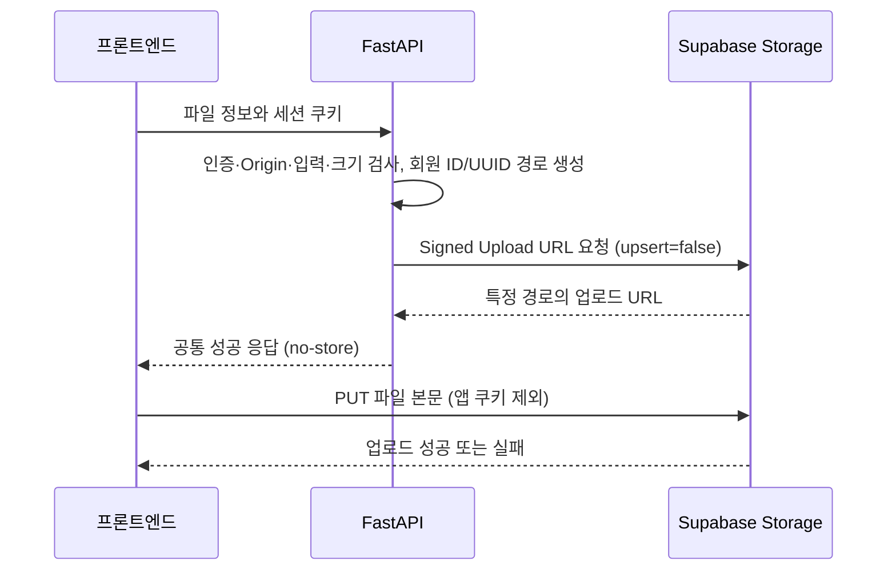

# Supabase Storage 파일 업로드

파일 저장소는 **Supabase Storage**를 사용한다. 기본 저장 대상은 비공개 `gomin-files` 버킷이며 파일 크기 제한은 10MiB다.

백엔드가 로그인 회원에게 Signed Upload URL을 발급하고 프론트엔드가 해당 URL로 파일을 직접 업로드한다. 파일 본문은 FastAPI를 거치지 않는다.

## 사용하는 모듈

| 구성 요소 | 모듈 | 역할 |
| --- | --- | --- |
| 백엔드 Storage | [backend/app/storage/supabase.py](../../backend/app/storage/supabase.py)의 `SupabaseFileStorage` | Supabase Python SDK의 `AsyncClient`로 회원별 객체 경로와 Signed Upload URL 생성 |
| 백엔드 의존성 | [backend/app/storage/dependencies.py](../../backend/app/storage/dependencies.py)의 `get_file_storage` | 기존 공유 Supabase 클라이언트와 Storage 설정 주입 |
| URL 발급 API | [backend/app/api/routes/files.py](../../backend/app/api/routes/files.py) | 세션·Origin·파일 정보 검사 후 업로드 URL 반환 |
| 프론트 업로드 | [frontend/src/lib/storage.ts](../../frontend/src/lib/storage.ts)의 `uploadFile` | `apiFetch`로 URL을 발급받고 브라우저 `fetch`로 파일을 Storage에 PUT |

프론트엔드는 공통 `uploadFile()` 함수와 브라우저 `fetch`를 사용한다. 업로드 권한은 백엔드가 발급한 URL로 전달된다.

## 흐름과 호출



파일 입력을 사용하는 기능에서 `frontend/src/lib/storage.ts`를 호출한다.

```ts
import { uploadFile } from "@/lib/storage";

const controller = new AbortController();
const uploaded = await uploadFile(file, { signal: controller.signal });
// uploaded: { bucket, path, filename, size, content_type }
// 기능별 API에서 uploaded.path를 업무 데이터에 연결한다.
// 취소할 때 controller.abort()를 호출한다.
```

함수는 `apiFetch`로 URL을 발급받고 파일을 해당 URL에 `PUT`으로 보낸다. Storage 요청에는 `credentials: "omit"`, `referrerPolicy: "no-referrer"`, `redirect: "error"`를 적용한다. 앱 쿠키·Authorization 헤더·서버 키를 전달하지 않는다. 빈 브라우저 MIME은 `application/octet-stream`으로 보낸다.

Storage의 성공 응답 이후에만 반환하며 빈 파일은 요청 전에 거절한다. 화면·업무 DB 저장·완료 콜백·다운로드·삭제·목록은 제공하지 않는다. 호출 기능이 업로드 경로를 업무 데이터와 연결해야 한다.

## URL 발급 API

`POST /api/v1/files/upload-url`에 기존 `gomin_session` 쿠키가 필요하다. Origin 헤더가 있다면 `CORS_ORIGINS`에 포함되어야 한다. 쿠키를 보유한 CLI 등 Origin 없는 호출도 가능하다.

```json
{
  "filename": "고민.pdf",
  "size": 1024,
  "content_type": "application/pdf"
}
```

| 입력 | 검증 |
| --- | --- |
| `filename` | 1~255자. 빈 이름·경로 구분자·제어문자 거절 |
| `size` | 양의 정수 바이트 수. 문자열·소수·boolean 거절 |
| `content_type` | 매개변수 없는 MIME type/subtype. 소문자 정규화 |

정의하지 않은 필드도 거절한다. 객체 경로와 버킷을 클라이언트가 지정할 수 없다.

성공 응답은 [공통 모델](api-response.md)의 `data`에 다음 값을 반환한다.

| 필드 | 의미 |
| --- | --- |
| `bucket` | 기본 `gomin-files` |
| `path` | 서버 생성 `{member UUID}/{file UUID}` |
| `upload_url` | 해당 경로에 파일을 생성하는 URL |
| `expires_in` | 업로드 URL 유효 기간 7200초 |
| `max_file_size_bytes` | 앱의 사전 크기 검사 제한, 기본 10485760 |

원본 이름은 저장 경로에 넣지 않는다. 요청마다 새 UUID 경로를 생성하며 기존 객체를 덮어쓰지 않는다. URL 발급은 파일 저장 완료를 의미하지 않는다. 응답에 `Cache-Control: no-store`를 적용한다.

| HTTP 상태 | 오류 코드 | 조건 |
| --- | --- | --- |
| 401 | `UNAUTHORIZED` | 로그인하지 않았거나 세션 만료 |
| 403 | `FORBIDDEN` | 허용되지 않은 Origin |
| 413 | `FILE_TOO_LARGE` | 신고한 크기가 앱 제한 초과 |
| 422 | `VALIDATION_ERROR` | 파일 정보·추가 필드 오류 |
| 503 | `STORAGE_UNAVAILABLE` | URL 발급 또는 응답 검증 실패 |

제공자 오류 원문·키·Signed URL은 실패 문구에 포함하지 않는다.

## 버킷과 설정

`supabase/migrations/20261006055549_file_storage_bucket.sql`은 비공개 `gomin-files` 버킷과 10MiB 제한을 구성한다. 익명·authenticated 역할에 일반 객체 업로드·읽기 정책을 추가하지 않는다. 프로젝트는 Supabase Auth를 사용하지 않으므로 브라우저 Supabase 로그인이나 `auth.uid()` 정책을 추가할 필요가 없다.

서버는 기존 `SUPABASE_URL`과 `SUPABASE_SECRET_KEY`로 URL을 발급한다. 서버 키는 RLS를 우회하므로 발급 전에 앱 세션을 확인한다. URL을 가진 클라이언트는 추가 Supabase 로그인 없이 해당 경로에 업로드한다.

`backend/.env.example`을 기준으로 설정한다.

| 설정 | 기본값 | 의미 |
| --- | --- | --- |
| `STORAGE_BUCKET` | `gomin-files` | 사전에 생성한 버킷 ID |
| `STORAGE_MAX_FILE_SIZE_BYTES` | `10485760` | 파일 정보의 사전 크기 검사 제한 |
| `SUPABASE_URL` | 기존 설정 | 로컬 또는 Cloud 주소 |
| `SUPABASE_SECRET_KEY` | 기존 설정 | 백엔드 전용 서버 키 |

앱 제한을 높일 때는 버킷의 `file_size_limit`도 새 마이그레이션으로 맞춘다. 버킷 이름을 바꿀 때는 대상 버킷을 먼저 구성한다. 앱 시작 시 버킷을 생성하지 않는다. 로컬·운영 적용은 [마이그레이션 관리](database-migrations.md)를 따른다. 프론트에 추가 Supabase 환경변수가 필요하지 않다.

## 유효 기간과 검증 경계

Signed Upload URL은 **2시간 유효**하며 개별 TTL을 설정할 수 없다. 발급 이후 로그아웃해도 만료까지 사용할 수 있다. URL과 쿼리의 토큰은 업로드 권한이므로 로그·문서·분석 도구에 저장하지 않는다.

크기·MIME 요청값은 URL에 개별 서명되지 않는다. API는 신고한 크기를 검사하고, **실제 최대 크기는 버킷의 10MiB 제한**으로 강제한다. 신고값과 실제 크기의 일치, MIME 진위·파일 내용·원본 이름은 검증하지 않는다. 현재 버킷에는 MIME 허용 목록이 없다. 파일 종류를 제한하는 업무 기능에는 버킷 MIME 제한과 업로드 후 검증을 별도로 설계한다.

발급 실패는 기존 `ApiRequestError`, Storage 업로드 실패는 `FileUploadError`로 전달한다. Storage HTTP 실패는 `UPLOAD_FAILED`, 통신 실패는 `UPLOAD_NETWORK_ERROR`이며 응답 본문은 노출하지 않는다. 통신 실패·서버 5xx는 `upload_uncertain: true`, 취소는 원래 `AbortError`를 전달한다. 전송 후 통신이 끊기거나 취소되면 실제 파일이 저장됐을 수 있다. 자동 재시도·새 경로 발급·정리는 하지 않는다.

## 검증

의존성이 설치된 Python과 Node.js 24 이상으로 저장소 루트에서 실행한다. 테스트는 실제 환경 파일이나 서버 키를 읽지 않는다.

```sh
PYTHONPATH=backend python -m unittest discover -s backend/tests
npm --prefix frontend test
npm --prefix frontend run lint
npm --prefix frontend run typecheck
python supabase/tests/storage-postgres.py
```

백엔드는 실제 SDK와 HTTPX MockTransport로 발급 요청·고유 경로·덮어쓰기 금지·응답·안전한 오류를 검증한다. API 테스트는 실제 세션 의존성과 모의 DB로 인증·쿠키·Origin·입력·크기·OpenAPI를 확인한다. 프론트는 발급→바이너리 PUT, MIME·쿠키 제외, 성공 후 반환, 실패·취소와 재시도 방지를 확인한다.

DB 테스트에는 로컬 Supabase DB 컨테이너와 Docker 접근 권한이 필요하다. 기본 컨테이너 `supabase_db_gomin`은 첫 인자로 바꿀 수 있다. auth·storage의 **스키마 정의만** 임시 DB에 복사하고 전체 프로젝트 마이그레이션, 버킷 설정·반복 적용·다른 버킷 보존·익명 접근 차단을 확인한 뒤 임시 DB를 삭제한다. 소유자·권한은 검증 DB에 맞게 구성하며 기존 개발 데이터는 복사하거나 초기화하지 않는다.

실제 Storage HTTP 업로드·실제 파일 크기 거절·브라우저 CORS·Cloud 구성은 별도 통합 확인이 필요하다. 모의 HTTP·DB 검사로 운영 적용 완료를 판단하지 않는다.

[Supabase Signed Upload URL](https://supabase.com/docs/reference/python/storage-from-createsigneduploadurl) · [버킷 정책](https://supabase.com/docs/guides/storage/buckets/fundamentals) · [문서 목록](../README.md)
