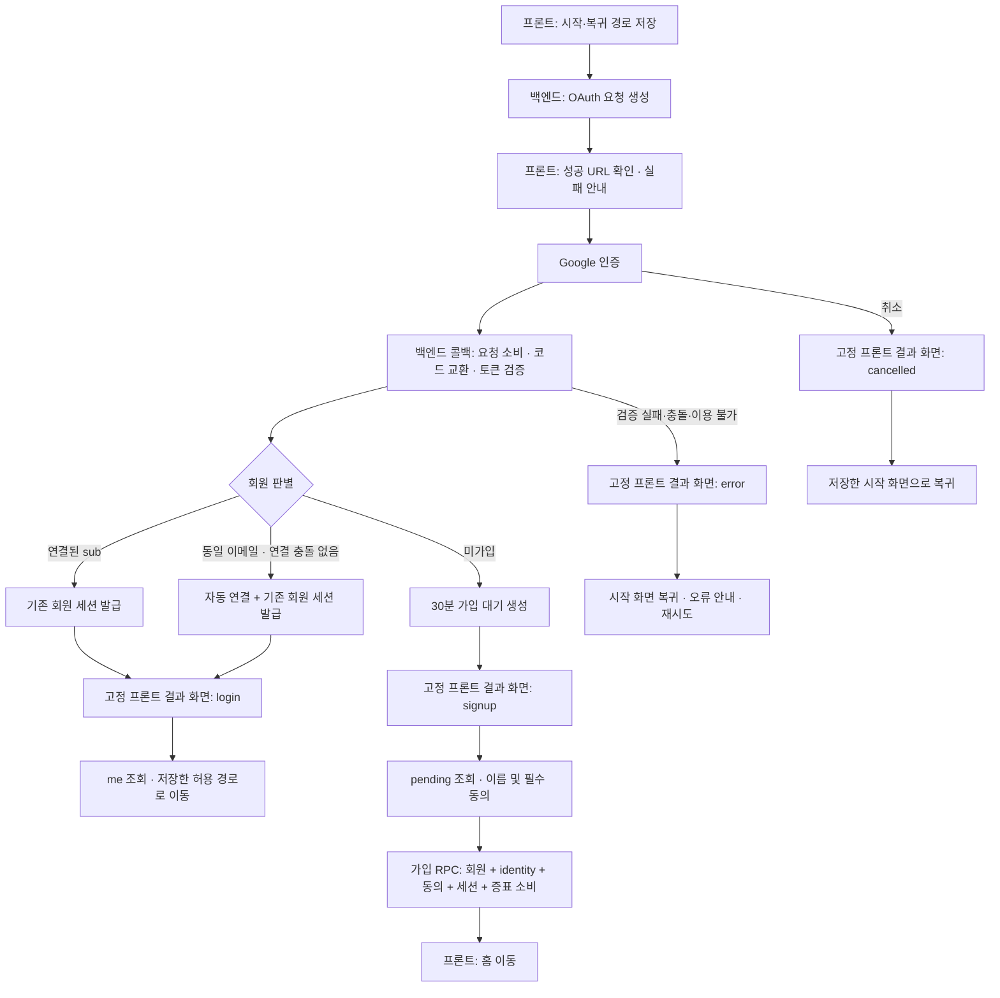

# Google OAuth 흐름 관리

- **문서 범위:** Google OAuth 인증 흐름과 관리 기준.
- **구현 경로:** `backend/app/api/routes/google_oauth.py`, `frontend/src/app/auth/google/`, `supabase/migrations/*_google_oauth*.sql`.

## 담당 영역

| 영역 | 관리 내용 |
| --- | --- |
| 프론트 | 시작·복귀 경로 sessionStorage 저장, 결과 화면, me/pending 조회, 이름·약관 입력, 화면 이동 |
| FastAPI | state·브라우저 결합·nonce·PKCE·ID 토큰 검증, 회원 판별, 자동 연결·세션 발급, 고정 결과 화면 redirect |
| PostgreSQL | 일회 요청·가입 증표 상태, 회원·Google identity·동의·세션, 원자적 소비·가입·연결 |
| Google | 사용자 인증, 인증 코드와 ID 토큰 발급 |

## 전체 흐름

- **콜백 수신:** Google 인증 성공·취소·실패 응답 모두 백엔드에서 수신.
- **요청 검증:** state·브라우저 결합·만료·미사용 여부 확인 후 결과 처리.
- **검증 실패:** 회원 생성·연결·세션 발급 차단.

## 단계별 호출과 상태

| 단계 | 호출·동작 | 백엔드·DB 상태 | 프론트 처리 |
| --- | --- | --- | --- |
| 시작 | GET /api/v1/auth/google/start?response=json | 10분 요청 생성, state digest·브라우저 결합 digest·nonce·암호화 PKCE verifier 저장, Google URL 반환 | 성공 시 경로 저장·Google 이동. 실패 시 현재 화면에서 안내·재시도 |
| 공급자 인증 | Google 인증 화면 | 요청 미사용 상태 | 같은 탭에서 인증 |
| 콜백 | GET /api/v1/auth/google/callback | 요청 잠금·검사·소비, 코드 교환, ID 토큰 검증, 완료 RPC에서 현재 요청 재확인 | 고정 /auth/google/result 수신 |
| 기존 로그인 | 연결된 sub 우선 조회 | 독립 세션 생성 | login 결과에서 GET /api/v1/auth/me |
| 자동 연결 | sub 미연결·동일 이메일 회원 | 연결 충돌 검사, identity·세션 원자 생성 | login 결과에서 me 조회 |
| 가입 대기 | 미가입 | 30분 pending 생성, 회원·세션 미생성 | signup 결과에서 GET /api/v1/auth/google/pending |
| 가입 제출 | POST /api/v1/auth/google/signup | 증표·이름·동의 검사, 회원·identity·동의·세션 생성 및 증표 소비 | AuthProvider 갱신, 홈 이동 |
| 가입 취소 | POST /api/v1/auth/google/cancel | 가입 대기 증표 무효화, 임시 쿠키 삭제 | 시작 화면 복귀 |
| 이후 세션 | GET /api/v1/auth/me, POST /api/v1/auth/logout | 기존 자체 세션 검증·갱신·현재 세션 삭제 | 기존 인증 상태 관리 |

## 인증 정보 수명

| 정보 | 저장 위치 | 유효기간·소비 |
| --- | --- | --- |
| 시작·복귀 경로 | 프론트 sessionStorage | 결과 처리 완료 시 제거. 회원가입 보완 중에는 시작 경로 유지 |
| OAuth 요청 | oauth_authorization_requests | 생성 후 10분. 최초 소비 후 완료 검사까지 유지. 완료 RPC에서 삭제 |
| state | Google 요청·콜백의 원문, DB의 state_digest | 백엔드가 원문을 생성하고 콜백 원문을 SHA-256 해시해 조회·비교 |
| 브라우저 결합 | HttpOnly 쿠키와 DB digest | 유효 OAuth 요청·가입 대기와 결합해 검사 |
| nonce | OAuth 요청 DB | 해당 요청 ID 토큰의 nonce와 비교 |
| PKCE verifier | OAuth 요청 DB의 암호문 | 요청 소비 시 DB 암호문 제거. 반환된 값으로 코드 교환 |
| 가입 증표 | HttpOnly 쿠키와 oauth_pending_actions의 proof_digest | 생성 후 30분. 가입 성공·취소 시 소비 |
| 서비스 세션 | gomin_session 쿠키와 auth_sessions의 token_digest | 7일, 유효 세션 요청 시 갱신. 로그아웃 시 삭제 |

- **새 인증 시작:** 동일 브라우저의 이전 OAuth 요청·가입 대기 무효화.
- **요청 재사용:** 소비·만료된 OAuth 요청 사용 금지.
- **Google 토큰:** access·ID·refresh 토큰의 서비스 세션 사용 및 장기 저장 금지.

## 결과 화면과 이동

- **결과 화면:** 백엔드에서 고정 프론트 `/auth/google/result`로 이동.
- **URL 전달 정보:** `login`·`signup`·`cancelled`·`error` 결과 구분과 안전한 오류 코드.
- **URL 제외 정보:** 토큰·프로필·이동 경로.

| 결과 | 프론트 확인 | 이동 |
| --- | --- | --- |
| login | me API로 실제 로그인 상태 확인 | 저장된 /, /talk, /collection, /settings 중 하나. 없거나 무효이면 / |
| signup | pending API로 유효 가입 대기 확인 | 가입 보완 화면. 완료 후 항상 / |
| cancelled | 저장된 시작 화면 확인 | /login 또는 /signup. 없거나 무효이면 /login |
| error | 안전한 오류 코드 및 시작 화면 확인 | 시작 화면 복귀 후 오류·재시도 안내 |

- **인증 상태 확인:** sessionStorage 값·URL 결과 구분을 인증 근거로 사용하지 않고 me·pending API로 확인.
- **로그인 가드:** 프론트 결과·가입 보완 화면은 일반 로그인 가드 적용 제외.
- **가입 대기 없음·만료:** 인증 시작 화면으로 안내.
- **me 연결 오류:** 로그아웃으로 처리하지 않고 오류 안내·재시도 제공.

## 회원 연결과 트랜잭션

| 조건 | 처리 |
| --- | --- |
| Google sub가 기존 identity에 있음 | 연결된 member ID로 로그인. 이메일·이름 자동 수정 없음 |
| sub 미연결, 검증된 이메일과 기존 이메일 일치 | 도메인과 무관하게 별도 승인·비밀번호 확인 없이 자동 연결 |
| sub 미연결, 동일 이메일 회원 없음 | 이름 보완·필수 약관 두 건 동의 후 신규 가입 |
| 다른 sub·회원과 연결 충돌 | 연결 덮어쓰기·회원 병합 거부 |

- **자동 연결:** 기존 회원 ID·이름·비밀번호·기록 유지. 새 회원·동의 내역 생성 없음.
- **신규 가입:** 회원·identity·필수 동의 두 건·초기 세션 생성과 증표 소비를 하나의 트랜잭션으로 처리.
- **Google HTTP 요청:** DB 트랜잭션 밖에서 수행.
- **콜백 완료:** 현재 요청 검사·회원 판별·세션 또는 가입 대기 생성·요청 삭제를 하나의 RPC로 처리.
- **새 시작과 늦은 콜백:** 같은 브라우저 잠금으로 직렬화. 새 시작에 무효화된 이전 요청의 완료 거부.
- **가입 충돌:** 가입 보완 중 이메일 선점·중복 가입 발생 시 HTTP 409로 종료 후 Google 로그인 재시작.

## 테이블별 저장 구조

### members

| 필드·제약 | 내용 |
| --- | --- |
| `id` | 기존 회원 PK. 자동 연결 시 유지 |
| `email` | 정규화한 소문자 이메일, UNIQUE |
| `name` | 사용자 이름 1~30자. 자동 연결 시 유지 |
| `password_hash` | 이메일 회원의 기존 해시 유지. Google 신규 회원은 NULL |

- **비밀번호 로그인:** NULL 해시 회원은 `INVALID_CREDENTIALS` 응답.
- **기존 필드:** 상세 기준은 [공통 인증·DB 기반](auth-foundation.md).

### member_oauth_identities

| 필드·제약 | 내용 |
| --- | --- |
| `member_id` | members FK, 회원 삭제 시 함께 삭제 |
| `provider` | `google`만 허용 |
| `subject` | 검증한 Google ID 토큰의 `sub` |
| `created_at` | 연결 시각 |
| `PRIMARY KEY(provider, subject)` | 동일 Google 계정의 중복 연결 금지 |
| `UNIQUE(member_id, provider)` | 회원당 Google 계정 하나만 연결 |

### oauth_authorization_requests

| 필드·제약 | 내용 |
| --- | --- |
| `state_digest` | state의 SHA-256 digest, 32바이트 PK |
| `browser_binding_digest` | 브라우저 쿠키의 SHA-256 digest, 32바이트 |
| `nonce` | ID 토큰 nonce 검사용 난수 |
| `pkce_verifier_encrypted` | Fernet 암호화 PKCE verifier. 소비 시 빈 값으로 제거 |
| `expires_at` | 생성 후 10분 |
| `consumed_at` | 최초 소비 시각. 미사용이면 NULL. 완료 RPC는 소비한 현재 요청만 허용 |

- **소비:** 행 잠금 후 브라우저 결합·DB 시각·미사용 여부 검사.
- **이동 경로:** 프론트 sessionStorage에서 관리.

### oauth_pending_actions

| 필드·제약 | 내용 |
| --- | --- |
| `proof_digest` | 가입 증표의 SHA-256 digest, 32바이트 PK |
| `browser_binding_digest` | 브라우저 쿠키의 SHA-256 digest, 32바이트 |
| `subject` | 검증한 Google sub |
| `email` | 검증한 소문자 이메일 |
| `profile_name` | Google 이름 제안. NULL 허용 |
| `expires_at` | 생성 후 30분 |
| `consumed_at` | 가입 성공·취소 시각. 미사용이면 NULL |

- **가입:** 증표 행 잠금 후 sub·이메일 잠금과 UNIQUE 제약으로 중복 방지.
- **동의·세션:** 기존 `member_consents`, `auth_sessions` 재사용.
- **DB 접근:** 세 테이블과 OAuth RPC는 service_role 전용, RLS 적용.

## 가입 보완 API와 쿠키

| 대상 | 계약 |
| --- | --- |
| `GET /api/v1/auth/google/start?response=json` | 임시 쿠키 설정과 `authorization_url` 반환. 기본 `/start` 호출은 Google 302 |
| `GET /api/v1/auth/google/pending` | `email`, `profile_name`, `expires_at`, `csrf_token` 반환 |
| `POST /api/v1/auth/google/signup` | 이름, 필수 동의 두 건의 종류·버전·동의 여부, `csrf_token` 제출 |
| `POST /api/v1/auth/google/cancel` | `csrf_token` 제출 |
| `gomin_oauth_browser` | 브라우저 결합용 HttpOnly 쿠키 |
| `gomin_oauth_proof` | 가입 증표 HttpOnly 쿠키. 가입 성공·취소 시 삭제 |

- **임시 쿠키:** `/api/v1/auth/google` 경로, SameSite=Lax, 30분.
- **변경 요청:** 정확한 Origin·브라우저 결합·증표·CSRF 검증.
- **CSRF 값:** 가입 증표에서 서버 HMAC으로 파생. pending 응답으로 전달하고 화면 메모리에 유지.
- **응답 캐시:** 인증 API·결과 redirect에 `Cache-Control: no-store` 적용.
- **콜백 로그:** 앱의 access log에서 콜백 쿼리 제거. 외부 프록시도 해당 경로의 쿼리 로그 제외 설정.

## 예외 처리

| 상황 | 처리 |
| --- | --- |
| Google 인증 취소 | 요청 검증 후 cancelled 결과, 시작 화면 복귀 |
| state 불일치·브라우저 결합 실패·요청 만료·재사용 | 인증 거부, error 결과, 새 인증 시작 |
| 코드 교환·ID 토큰 검증 실패 | 회원 변경 없이 error 결과 |
| Google·DB 이용 불가 | 시작 전에는 현재 화면에서 오류·재시도. 콜백 이후에는 안전한 error 결과 |
| 이름·동의 입력 오류 | 가입 보완 화면에서 수정 |
| 약관 버전 변경 | 새 약관을 조회·표시한 뒤 다시 동의 |
| 가입 증표 만료·재사용 | 가입 거부, 새 Google 인증 시작 |
| 가입 경합·연결 충돌 | 가입·연결 트랜잭션 롤백, 오류 안내 |
| 로그인 성공 뒤 me 조회 401 | 인증 시작 화면으로 안내 |
| 로그인 성공 뒤 me 연결 오류 | 현재 화면에서 오류·재시도 제공 |

## 설정과 확인 항목

| 설정 이름 | 설명 |
| --- | --- |
| `GOOGLE_OAUTH_CLIENT_ID` | Google Cloud에서 발급한 웹 애플리케이션 OAuth 클라이언트 ID |
| `GOOGLE_OAUTH_CLIENT_SECRET` | 인증 코드·토큰 교환용 백엔드 클라이언트 비밀값 |
| `GOOGLE_OAUTH_REDIRECT_URI` | Google 인증 응답 수신용 백엔드 콜백 URL. Google Cloud 등록 URI와 정확히 일치 |
| `AUTH_FRONTEND_ORIGIN` | 프론트 출처(스킴·호스트·포트). 고정 결과 화면 `/auth/google/result` 주소 구성 및 가입 요청 Origin 검사에 사용 |
| `AUTH_OAUTH_ENCRYPTION_KEY` | `Fernet.generate_key()`로 생성한 독립 키. PKCE verifier 암호화·복호화와 가입 CSRF 값 생성에 사용 |
| `AUTH_COOKIE_SECURE` | 로컬 HTTP는 `false`, 운영 HTTPS는 `true` |
| `CORS_ORIGINS` | `AUTH_FRONTEND_ORIGIN`을 포함하는 정확한 프론트 출처 목록 |
| `NEXT_PUBLIC_API_BASE_URL` | 프론트에서 직접 호출하는 API 출처. 로컬·운영에 맞게 설정 |
| `AUTH_TERMS_VERSION`, `AUTH_PRIVACY_VERSION` | 프론트 약관 전문의 현재 버전과 일치 |

- **Google Cloud 등록:** 백엔드 콜백 URL과 정확히 일치하는 URI 등록.
- **주소 구분:** Google 응답 수신용 백엔드 콜백과 프론트 결과 화면을 별도로 관리.
- **운영 출처:** 같은 상위 도메인의 HTTPS 프론트·API 사용.
- **운영 쿠키:** Secure·HttpOnly·SameSite=Lax 적용.
- **CORS:** 등록된 프론트 출처의 credentials 포함 요청 허용.
- **미설정:** Google 시작 API만 503 `OAUTH_NOT_CONFIGURED`. 기존 이메일 인증·로그인과 앱 기동 유지.

### 로컬과 운영 주소

| 항목 | 로컬 기본값 | 운영 |
| --- | --- | --- |
| 프론트 출처 | `http://127.0.0.1:3000` | 실제 프론트 HTTPS 출처 |
| API 출처 | `http://127.0.0.1:8000` | 실제 API HTTPS 출처 |
| 등록 콜백 | `http://127.0.0.1:8000/api/v1/auth/google/callback` | API 출처 + `/api/v1/auth/google/callback` |
| 결과 화면 | `http://127.0.0.1:3000/auth/google/result` | 프론트 출처 + `/auth/google/result` |
| Secure 쿠키 | `false` | `true` |

- **localhost 대안:** 프론트 접속·API URL·등록 콜백·Origin·CORS를 모두 `localhost`로 통일.
- **호스트 일치:** `localhost`와 `127.0.0.1`을 혼용하지 않음.
- **Google Cloud:** 웹 애플리케이션 클라이언트와 동의 화면 설정. 테스트 상태이면 사용할 Google 계정을 테스트 사용자에 등록.
- **환경 전환:** 동일 구현 사용. 설정 변경 후 백엔드 재시작·프론트 재빌드.
- **키 변경:** 진행 중인 OAuth 요청의 복호화 불가. 사용자는 새 Google 인증 시작.

### 정리 작업

- **인증 시작:** `gomin_auth_oauth_cleanup()` 호출로 만료한 요청 및 만료·소비한 가입 대기 삭제.
- **소비한 요청:** 진행 중 콜백의 완료 검사에 사용. 완료 시 삭제, 미완료 요청은 10분 만료 후 삭제.
- **주기 정리:** 운영 DB 스케줄러에서 같은 함수를 호출. 실행 역할에는 service_role과 동일한 테이블·함수 권한 필요.
- **마이그레이션:** 기존 인증 마이그레이션 후 `20261004102555_google_oauth.sql`, `20261004110048_google_oauth_completion.sql` 순서로 적용. 로컬은 `npm run db:migrate`.

[Google OpenID Connect 설정](https://developers.google.com/identity/openid-connect/openid-connect#settingup)

### 검증 명령

| 명령 | 확인 내용 |
| --- | --- |
| `PYTHONPATH=backend python -m unittest discover -s backend/tests -v` | API·JWT·쿠키·기존 이메일 인증 회귀 |
| `npm --prefix frontend test` | API 호출·허용 경로·sessionStorage 오류 처리 |
| `npm --prefix frontend run lint` · `npm --prefix frontend run typecheck` · `npm --prefix frontend run build` | 프론트 코드 규칙·타입·프로덕션 빌드 |
| `PGLITE_MODULE=<PGlite 모듈 경로> node --test supabase/tests/*.test.mjs` | SQL 상태·제약·권한·가입 원자 처리 |
| `python supabase/tests/google-oauth-postgres.py` | 로컬 Supabase DB의 다중 연결 경합·롤백. 임시 DB 생성·삭제 |

### 브라우저 확인

- 신규 가입·기존 sub 로그인·동일 이메일 자동 연결
- 취소·만료·재사용·연결 충돌·가입 경합
- 이름 보완·필수 동의·약관 버전 변경
- 프론트 경로 허용 목록·sessionStorage 누락·결과 화면 새로고침
- state·브라우저 결합·nonce·PKCE·ID 토큰 검증
- me·로그아웃·기존 이메일 로그인 회귀

[공통 인증·DB 기반](auth-foundation.md) · [이메일 로그인과 세션](login-auth.md) · [회원가입 구현](signup.md) · [문서 목록](../README.md)
