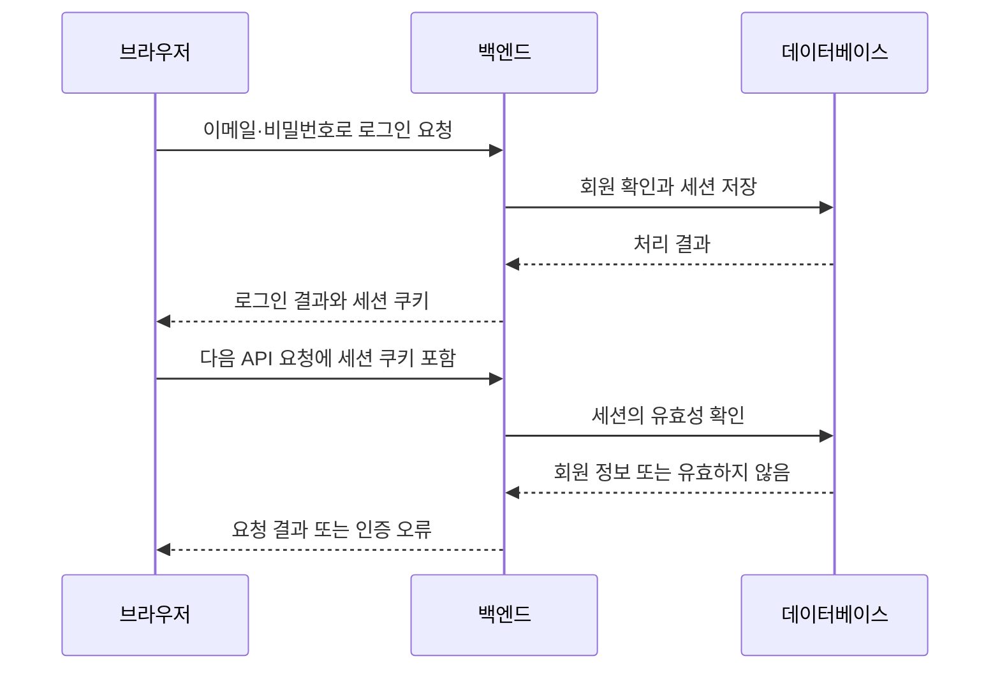

# 인증과 인가

로그인한 사용자가 다른 사람의 정보를 수정하려고 하면 어떻게 해야 할까? 로그인 여부를 확인하는 일과 그 작업을 허용하는 일은 별개의 판단이다. 이 둘을 인증과 인가라고 부른다.

## 누구인지, 무엇을 해도 되는지

인증은 요청한 사람이 누구인지 확인하는 일이다. 이메일과 비밀번호 확인, 로그인 세션 검증 등이 여기에 속한다. 인가는 확인한 사용자에게 특정 작업을 허용할지 판단하는 일이다.

게시글 수정 기능을 예로 들면 로그인 정보로 사용자를 확인한 뒤 그 사용자가 작성자인지 검사할 수 있다.

HTTP `401`은 유효한 인증 정보가 필요할 때, `403`은 작업을 허용하지 않을 때 주로 사용한다. 실제 응답은 해당 API의 약속을 함께 읽어야 한다.

## 로그인 상태를 이어가는 방법

HTTP는 요청마다 독립적으로 메시지를 주고받는다. 로그인에 성공한 다음 요청에서도 사용자를 알아보려면 그 요청에 인증 정보를 함께 보내야 한다.

세션 방식에서는 서버가 로그인 상태를 보관하고 클라이언트에 그 상태를 찾을 수 있는 식별자를 전달한다. 다음 요청에서 식별자를 받으면 서버가 유효한 세션인지 확인한다. 로그아웃하거나 만료되면 해당 세션을 더 이상 사용하지 못하게 한다.

쿠키는 브라우저가 보관하고 정해진 조건에 맞는 요청에 함께 보내는 작은 데이터다. 로그인 세션 식별자를 쿠키에 담을 수 있다. 쿠키는 데이터를 운반·보관하는 장치이고 세션은 서버가 로그인 상태를 관리하는 방식이다.

## 세션 로그인 흐름

비밀번호를 매 요청마다 다시 보내는 대신 세션 식별자를 사용한다. 이 식별자도 다른 사람이 갖게 되면 악용할 수 있는 인증 정보이므로 보호해야 한다.

## 쿠키에서 자주 보는 설정

| 설정 | 역할 |
| --- | --- |
| `HttpOnly` | JavaScript가 쿠키 값을 직접 읽지 못하게 한다. 브라우저의 요청 전송에는 사용할 수 있다. |
| `Secure` | 일반적인 운영 환경에서 HTTPS 요청에만 쿠키를 전송하도록 제한한다. |
| `SameSite` | 다른 사이트에서 시작한 요청에 쿠키를 보낼 조건을 정한다. |
| `Domain`, `Path` | 쿠키를 보낼 호스트와 경로의 범위를 정한다. |
| `Max-Age`, `Expires` | 브라우저가 쿠키를 보관할 수명을 정한다. |

쿠키 수명과 서버 세션 수명은 따로 관리된다. 브라우저에 쿠키가 남아 있어도 서버의 세션이 만료되거나 삭제되면 로그인은 유효하지 않을 수 있다. `HttpOnly` 같은 설정 하나로 모든 공격을 막는 것도 아니다.

## 토큰과 비밀번호

토큰은 인증이나 권한 확인에 사용하는 값을 넓게 부르는 말이다. 세션 식별자도 토큰으로 사용할 수 있다. JWT는 토큰을 표현하는 형식 중 하나이며 모든 토큰이 JWT인 것은 아니다. JWT 자체가 로그아웃이나 권한 검사를 대신해 주지도 않는다.

비밀번호 원문 대신 비밀번호 저장용 해시값을 보관하고 입력한 비밀번호를 그 값과 대조해 검증한다. 해시는 입력값에서 검증용 값을 계산하는 방식이다. 암호화처럼 복호화해서 원문을 되찾는 용도가 아니다.

## 우리 프로젝트에서는

인증은 FastAPI가 처리한다. Supabase Auth로 로그인하는 구조가 아니며 회원과 세션 데이터를 Supabase DB에 저장한다. 이메일 로그인과 Google 로그인은 성공 후 같은 자체 세션을 사용한다.

세션 쿠키 이름은 `gomin_session`이다. DB에는 원문 세션 토큰 대신 해시값을 저장한다. `GET /api/v1/auth/me`는 세션을 확인하고 `POST /api/v1/auth/logout`은 현재 세션과 쿠키를 제거한다.

브라우저는 `credentials: "include"` 옵션으로 백엔드 요청에 쿠키를 포함한다. 운영에서는 같은 상위 도메인의 HTTPS 프론트·API 주소를 사용하도록 구성한다. 출처와 쿠키 전송 조건은 [CORS와 출처](cors.md)에서 이어서 설명한다.

구현 세부 사항은 [공통 인증·DB 기반](../../engineering/auth-foundation.md)과 [이메일 로그인과 세션](../../engineering/login-auth.md)을 따른다.

## 이어서 읽기

- [CORS와 출처](cors.md)

## 참고 자료

- [MDN: HTTP 쿠키](https://developer.mozilla.org/en-US/docs/Web/HTTP/Guides/Cookies)
- [OWASP: 비밀번호 저장](https://cheatsheetseries.owasp.org/cheatsheets/Password_Storage_Cheat_Sheet.html)

[목차](../README.md)
