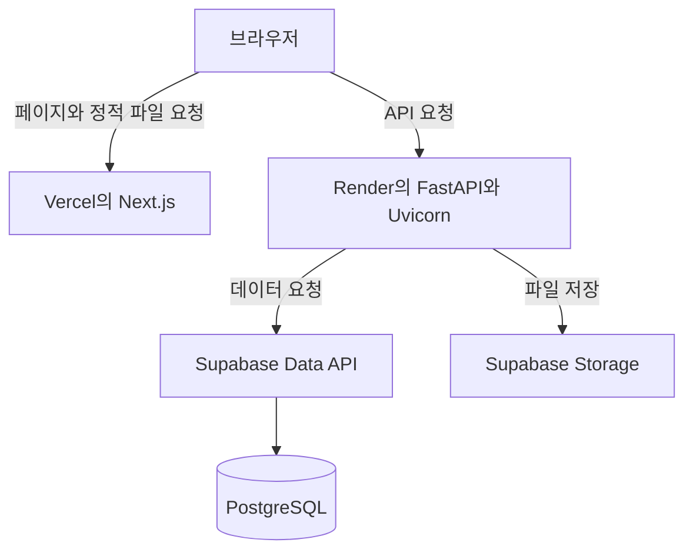

# 웹 서비스는 어떻게 움직일까

웹사이트에서 로그인 버튼을 누르면 어떤 일이 일어날까? 브라우저가 입력값을 보내고 서버가 회원 정보를 확인한 뒤 결과를 돌려준다. 화면에 보이는 동작 하나에도 여러 프로그램이 함께 일한다.

## 인터넷과 웹

인터넷은 컴퓨터끼리 데이터를 주고받도록 연결한 거대한 네트워크다. 웹은 그 연결 위에서 문서와 서비스를 제공하는 방식이다. 이메일처럼 인터넷을 사용하면서 웹과는 다른 규칙으로 동작하는 서비스도 있다.

브라우저는 웹에 접속하는 프로그램이다. Chrome, Safari, Firefox가 여기에 해당한다. 주소창에 URL을 입력하면 브라우저가 해당 주소로 요청을 보내고 받은 내용을 화면에 표시한다. 한 페이지를 표시하려고 HTML, 스타일, 스크립트, 이미지 등을 여러 번 요청하기도 한다.

## 클라이언트와 서버

클라이언트는 서비스를 요청하는 쪽, 서버는 요청을 받아 처리하는 쪽이다. 웹에서는 브라우저가 클라이언트인 경우가 많다. 다른 서버나 모바일 앱도 클라이언트가 될 수 있다.

여기서 서버라는 말은 컴퓨터와 프로그램을 모두 가리킨다. “서버에 접속한다”는 말과 “서버를 실행한다”는 말에서 뜻이 조금 다르다. 문맥에 따라 요청을 받는 컴퓨터인지, 그 컴퓨터에서 실행하는 프로그램인지 살펴보면 된다.

클라이언트와 서버는 고정된 신분도 아니다. 백엔드는 브라우저의 요청을 받을 때 서버이지만 외부 저장 서비스에 요청을 보낼 때는 클라이언트다.

## 화면과 데이터 처리

**프론트엔드**는 사용자가 보는 화면과 조작을 담당한다. 입력란을 보여주고 버튼 클릭에 반응하며 서버에서 받은 결과를 표시한다. **백엔드**는 요청을 검증하고 회원 확인, 데이터 조회·저장 같은 일을 처리한다.

**데이터베이스**는 회원 정보처럼 구조가 있는 데이터를 저장한다. **파일 저장소**는 이미지나 PDF 같은 파일을 보관한다. 화면에 잠시 표시한 값과 서버에 저장한 값은 수명이 다르다. 새로고침 후에도 값을 유지하려면 어디에 저장할지 정해야 한다.

프론트엔드와 백엔드를 꼭 서로 다른 컴퓨터에서 실행해야 하는 것은 아니다. 역할과 배포 위치는 별개의 구분이다. Next.js처럼 화면을 만드는 프레임워크에도 서버에서 실행하는 기능이 있다.

## 우리 프로젝트에서는

브라우저는 Vercel에서 제공하는 페이지를 열고 인증 등에 필요한 API 요청은 Render의 백엔드로 직접 보낸다. 모든 요청이 Vercel을 거쳐 백엔드로 가는 구조는 아니다.

백엔드는 Supabase Data API로 데이터베이스에 접근한다. 파일 저장은 별도의 Storage 모듈이 담당한다. 자세한 구성은 [시스템 아키텍처](../../ARCHITECTURE.md)에서 확인한다.

## 자주 헷갈리는 점

우리 프로젝트의 홈은 브라우저에서 인증 API를 호출하고 로그인 상태에 따라 접근을 제어한다. 페이지가 열려도 백엔드나 데이터베이스에 문제가 있을 수 있으므로 인증과 각 기능이 제대로 동작하는지는 따로 확인해야 한다.

사용자가 화면에서 보낸 값도 그대로 믿지 않는다. 브라우저의 입력 제한을 우회해 요청을 보낼 수 있어서 백엔드가 입력과 권한을 다시 확인한다.

## 이어서 읽기

- [HTTP와 요청·응답](http.md): 프로그램이 주고받는 메시지
- [프론트엔드와 Next.js](../application/frontend.md): 화면을 만드는 구성 요소
- [백엔드와 FastAPI·Uvicorn](../application/backend.md): 요청을 처리하는 구성 요소

## 참고 자료

- [MDN: 인터넷은 어떻게 동작할까](https://developer.mozilla.org/en-US/docs/Learn_web_development/Howto/Web_mechanics/How_does_the_Internet_work)

[목차](../README.md)
